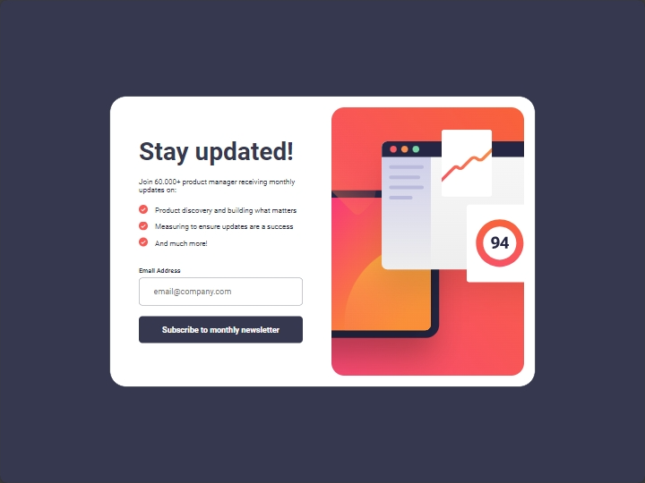
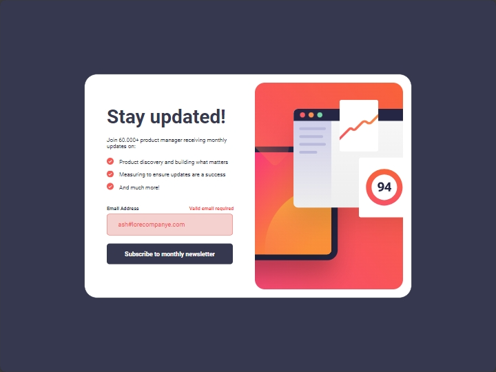
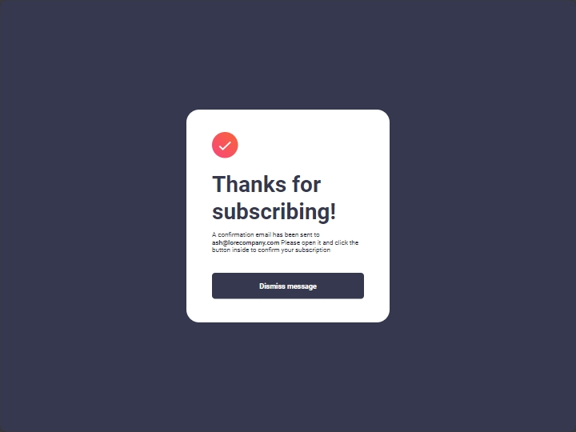
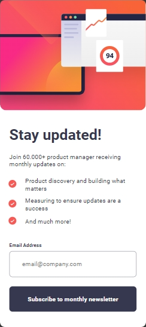
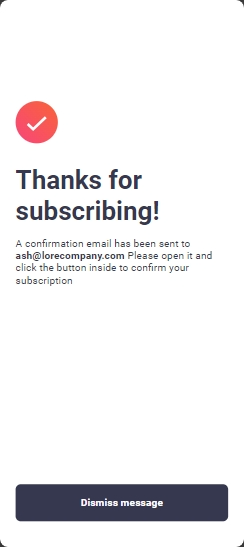

# Frontend Mentor - Newsletter sign-up form with success message



## Welcome! 👋

## Table of contents

- [Overview](#overview)
  - [The challenge](#the-challenge)
  - [Screenshot](#screenshot)
  - [Links](#links)
- [My process](#my-process)
  - [Built with](#built-with)
  - [What I learned](#what-i-learned)
  - [Continued development](#continued-development)
- [Author](#author)

## Overview

### The challenge

Users should be able to:

- Add their email and submit the form
- See a success message with their email after successfully submitting the form
- See form validation messages if:
  - The field is left empty
  - The email address is not formatted correctly
- View the optimal layout for the interface depending on their device's screen size
- See hover and focus states for all interactive elements on the page

### Screenshot

 
  

### Links

- Solution URL: [Add solution URL here](https://your-solution-url.com)
- Live Site URL: [Add live site URL here](https://your-live-site-url.com)

## My process

### Built with

- Semantic HTML5 markup
- Flexbox
- Mobile-first workflow

### What I learned

In this project, I learned how to create hierarchy in text using em size format and I created a state for input elements when an invalid.

```css
.content-newsletter h2 {
  font-size: 3.5em;
}
.content-success > h2 {
  font-size: 2.5em;
  font-weight: 700;
}
```

```js
email.addEventListener('invalid', (e) => {
    if (e.target.validity.typeMismatch || e.target.validity.valueMissing) {
        e.target.setCustomValidity(' ');
        email.classList.add('invalid');
        labelEMail.classList.add('active');
    } else {
        email.classList.remove('invalid');
        labelEMail.classList.remove('active');
    }
})
```

### Continued development

After i using em size format in this project. I will use this method to create hierarki in the next project.

## Author

- Twitter - [@abdulsikode](https://www.twitter.com/abdulsikode)
